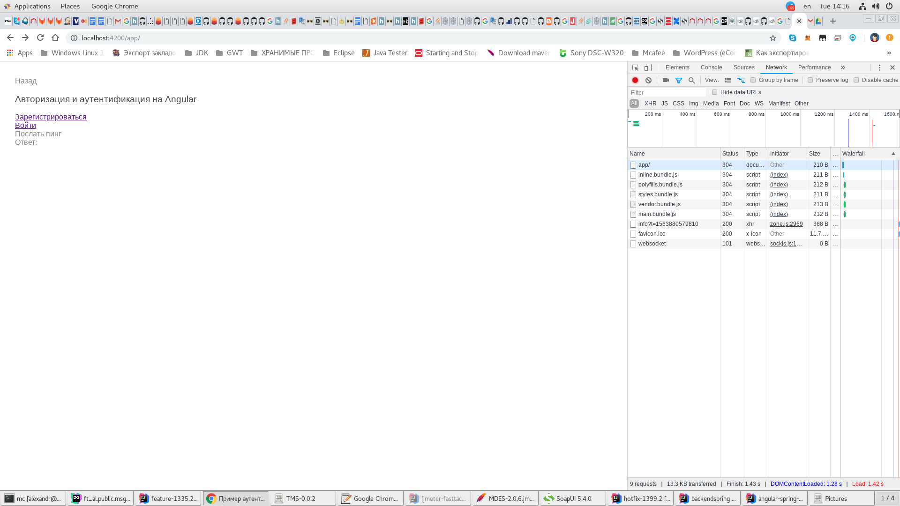
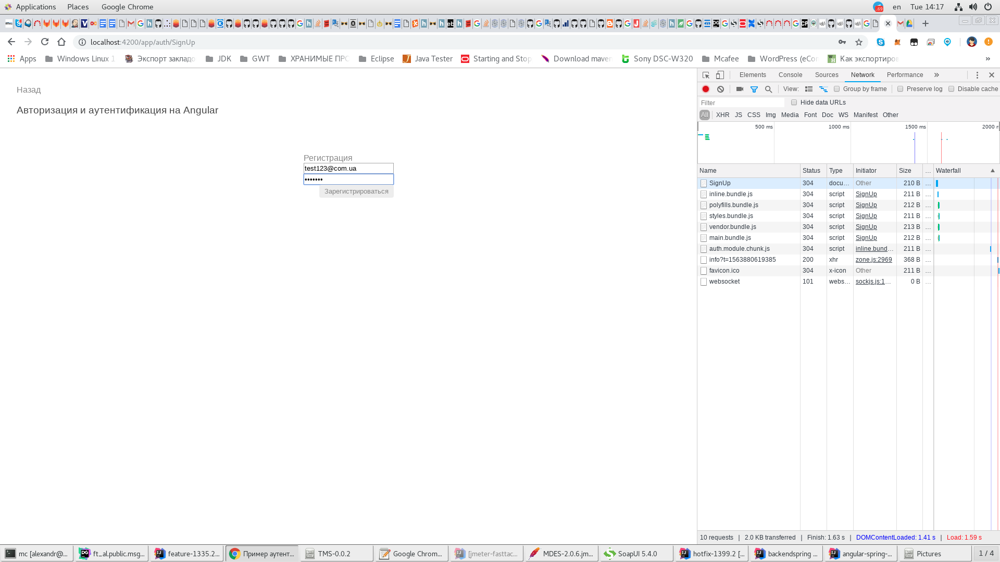
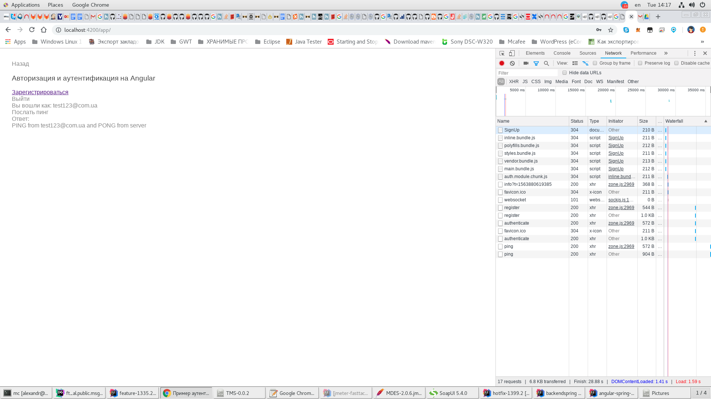
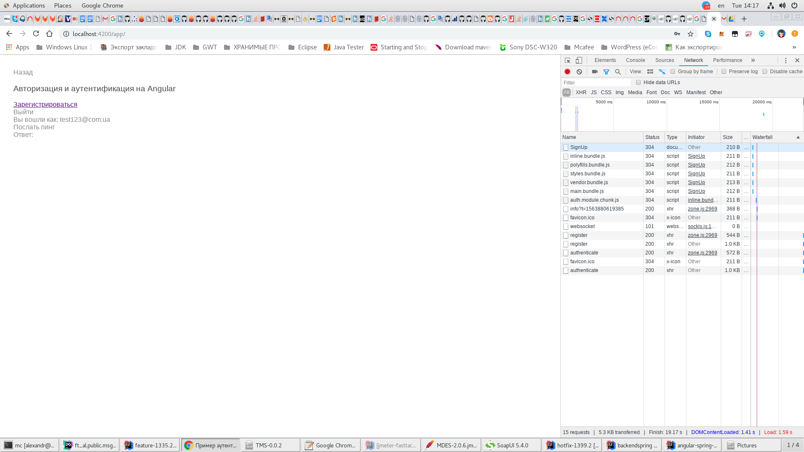

# Аутентификации на Angular и Spring

- (Аутентификации на Angular и Spring без Spring Security)
    - (Часть 2. Сервер на Spring)
        https://habr.com/ru/post/354862
        https://github.com/lynx-r/angular-spring-authentication-server-spring/tree/classic-approach
        ```
        backendspring >> start as SpringBoot Application
        2019-07-23 13:58:20.472  INFO 7990 --- [  restartedMain] o.s.b.w.embedded.tomcat.TomcatWebServer  : Tomcat started on port(s): 8080 (http) with context path ''
        ```
    - (Часть 1. Клиент на Angular)
        https://habr.com/ru/post/354860
        https://github.com/lynx-r/angular-spring-authentication-web-angular/tree/classic-approach
        ```
        npm install
        yarn start
        ** NG Live Development Server is listening on localhost:4200, open your browser on http://localhost:4200/ **
        ```









